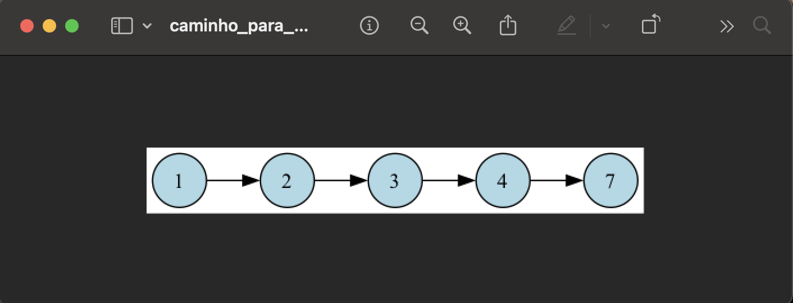

# Controle de Estoque (Vestuário) - Algoritmos de Ordenação

## Sobre 
Sistema prático de gerenciamento e controle de estoque para uma loja de roupas, desenvolvido para demonstrar e comparar a eficiência de diferentes algoritmos de ordenação na disciplina de **Estruturas de Dados e Algoritmos 2 (EDA2)**.

## Alunos


<div align = "center">
<table>
  <tr>
    <td align="center"><a href="https://github.com/alvesingrid"><br /><sub><b>Ingrid Alves</b></sub></a><br /><a href="Link git" title="Rocketseat"></a></td>
    <td align="center"><a href="https://github.com/Ericcs10"><br /><sub><b>Leticia Torres </b></sub></a><br />
  </tr>
</table>

## 👥 Autores

| Matrícula |Nome|
| :--- | :--- |
| 202045348 | **Ingrid Alves Rocha**|
| | **Eric Camargo da Silva** |

---

## 👕 Sobre o Projeto e Modelagem

O sistema gerencia um acervo de peças de roupas. Cada item no estoque é modelado contendo identificadores práticos para filtragem e listagem:
* `código` (inteiro único)
* `descrição` e `tamanho` (strings)
* `preço` (ponto flutuante)
* `quantidade` em estoque (inteiro)

---

## 📚 Algoritmos Implementados e Aplicação Prática

Cada método de ordenação foi escolhido para suprir uma necessidade de listagem específica do estoque:

### 1. Insertion Sort (Filtro por Preço)
* **Uso Prático**: Ideal para ordenar subconjuntos ou itens adicionados ao carrinho do menor para o maior preço.
* **Teoria**: Algoritmo simples, natural e estável. É amplamente utilizado no cotidiano (como na organização de cartas em jogos de tranca e buraco). Possui complexidade $O(n^2)$, mas garante o menor número de trocas e comparações caso os dados já estejam parcialmente ordenados.

### 2. Bubble Sort (Auditoria de Quantidade)
* **Uso Prático**: Empregado para ordenar o estoque com base na quantidade disponível, permitindo visualizar rapidamente peças esgotadas.
* **Teoria**: Compara e troca elementos adjacentes sucessivamente. Os itens maiores vão "borbulhando" para o final do vetor a cada iteração, repetindo o processo até que o conjunto esteja ordenado.

### 3. Shell Sort (Listagem Principal por Código)
* **Uso Prático**: Utilizado para a ordenação veloz de todo o catálogo de peças através de seus códigos de identificação.
* **Teoria**: Criado por Donald Shell em 1959, é considerado o algoritmo mais eficiente entre os de complexidade quadrática. Opera como um refinamento do Insertion Sort, aplicando inserções em múltiplos segmentos espaçados do vetor.

---

## 🚀 Como Executar

1. Clone o repositório:
   ```bash
   git clone [https://github.com/indalvess/eda2-estoque-ordenacao.git](https://github.com/indalvess/eda2-estoque-ordenacao.git)

## Screenshots
<p align="center">
  
</p>

<p align="center">
  
</p>

<p align="center">
  
</p>

<p align="center">
  
</p>

<p align="center">
  
</p>

<p align="center">
  
</p>

<p align="center">
  
</p>

<p align="center">
  
</p>

<p align="center">
  
</p>


## Instalação 
**Linguagem**: C++

## Pré-requisitos

Antes de rodar o projeto, você precisará ter os seguintes programas instalados:

- **g++** (compilador C++).
- **make** (ferramenta de automação de builds).
- **Graphviz (dot)** para gerar e visualizar os grafos do caminho.

### Instalar g++, make e dot

#### No macOS:
Se você usa macOS, pode instalar com o Homebrew:

```bash
brew install gcc make graphviz
```

#### No Linux (Ubuntu/Debian):
No Linux, instale com:

```bash
sudo apt update
sudo apt install build-essential graphviz
```

## Como compilar e executar o projeto
### Passo 1: Clonar o repositório
```bash
git clone https://github.com/seu-usuario/Grafos-1-Parking-lot.git
cd Grafos-1-Parking-lot
```

### Passo 2: Compilar o projeto
Para compilar o projeto, use o comando make. Isso irá compilar todos os arquivos fonte e gerar o executável:

```bash
make
```

### Passo 3: Rodar o projeto
Após a compilação, execute o programa gerado:

```bash
./Grafos-1-Parking-lot
```

## Uso 
Após rodar o programa, escolha uma loja. O sistema encontrará a vaga mais próxima disponível usando o algoritmo BFS, e um grafo será gerado mostrando o caminho até essa vaga.

O grafo será salvo como uma imagem `.png` no formato:

```
caminho_para_vaga_X.png
```

(onde `X` é o número da vaga).

## Apresentação 

<div align="center">
<a href="https://youtu.be/PoJ3FK-J3wM?si=VLjQ5nK-w6U8Dh7-"></a>
</div>

<font size="3"><p style="text-align: center">Autor: [Bianca Patrocínio](https://github.com/BiancaPatrocinio7) e [Letícia Torres](https://github.com/leticiatmartins).</p></font>


## Outros 
- O projeto usa a biblioteca Graphviz para gerar arquivos `.dot` e convertê-los em imagens PNG.
- Se tiver problemas para visualizar as imagens, verifique se o `dot` está instalado corretamente.
  


